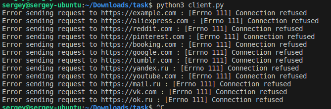
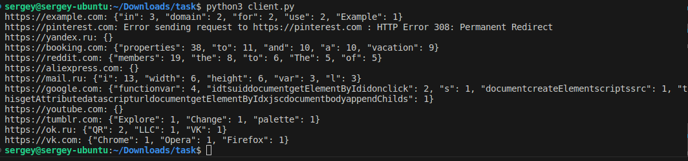
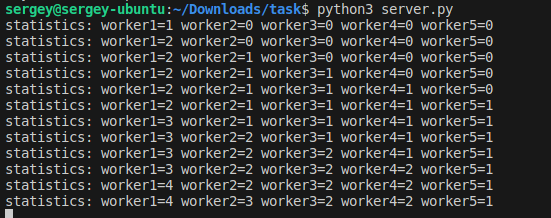

# Python-Client-Server-App
client server multithreaded socket architecture

For start app:
- python3 server.py (Start server first)
- python3 client.py (After can start client)

Output of the client's work without work server:

Output of the client's work with working server:

Output server work:

